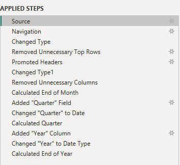

# Adidas-Sales-Data-Analysis-using-Power-BI

## Introduction
I sought to apply the skills and knowledge I acquired to analyze and visualize sales data from adidas which I obtained here [Kaggle](https://www.kaggle.com/datasets/heemalichaudhari/adidas-sales-dataset) using Microsoft Power Bi.

## Data Overview
The data contains sales data from Adidas between 2021 and 2022. The data is contained in one sheet and it has the following columns: Retailer, Retailer ID, Invoice Date, Region, State, City, Product, Price per Unit, Units Sold, Total Sales, Operating Profit, Operating Margin, and Sales Method. I took the following steps to transform the data:

### Features
This overview page gives a summary of my findings.

- You can filter by Year, Region and Product.
- The navigation pane can be used to navigate to the other pages to view in detail or the map.

The "Detailed View" section shows the region and sales method in detail and can also be filtered. 

I also inserted a map to visualize sales in different states.

## Key Findings and Insights
From the data, I found out that Men’s Street Foot Wear brought in the most money, West Gear made most of the sales where 625,000 units were sold. The most used sales method was in-store where most consumers shopped at Sport’s Direct whereas Footlocker handled most of the online orders.  The West Region was the favorite consumer. The City of New York orders the most sales (169,000) where most were ordered via Walmart outlet.

## Conclusion
Men’s Street Footwear generated the most revenue.
